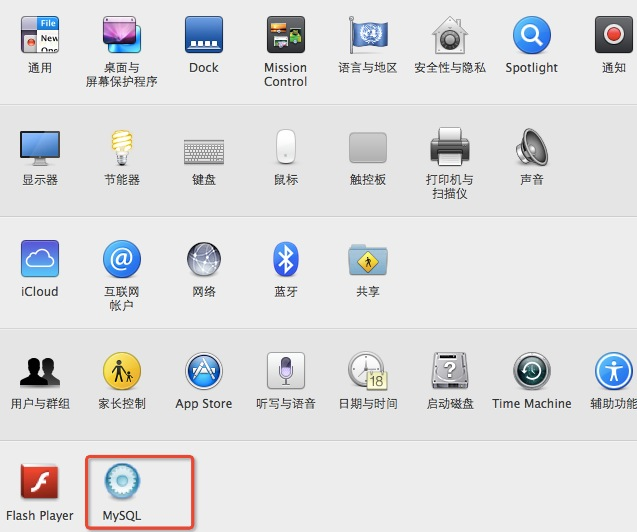

###一、 下载MySQL

   * 访问MySQL的官网<a href="http://www.mysql.com/downloads/">点击下载</a> 然后在页面中会看到“MySQL Community Server”下方有一个“download”点击。下载“.dmg”文件包。


###二、 安装MySQL

   * 安装完成之后，在偏好设置中会出现<br /></img>   
    <p>打开，设置开启mysql。  
    
###三、 配置MySQL环境
 
   * 路径的问题,把MYSQLPATH/bin/mysql映射到/usr/local/bin目录下：

```
cd /usr/local/bin 
ln -fs /MYSQLPATH/bin/mysql mysql
```

    
